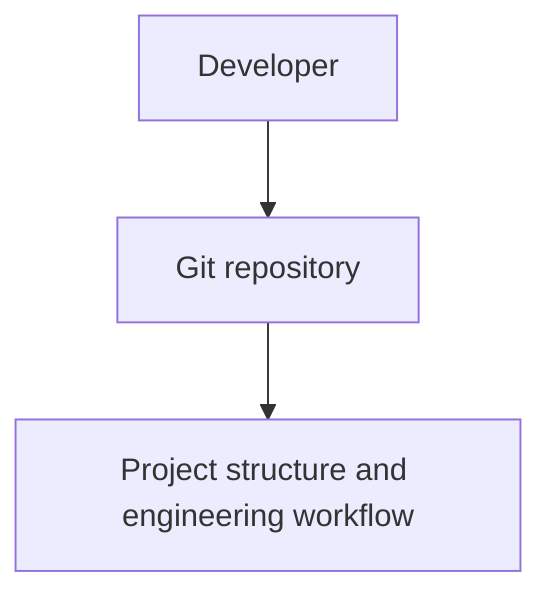
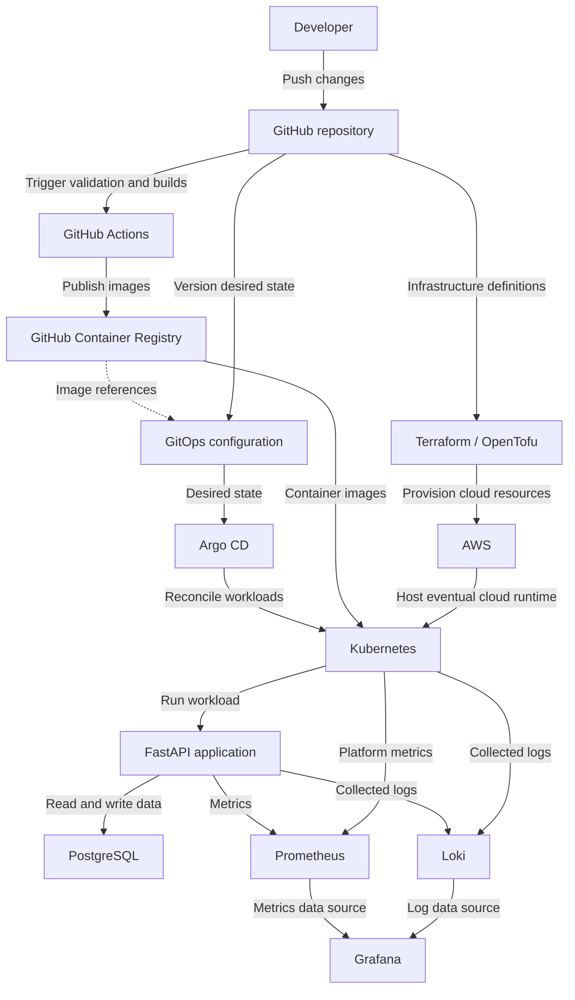

# Architecture Overview

## 1. Purpose

This document records the **Current Architecture** and **Target Architecture**
of One Serious Project. The target architecture represents direction rather
than current implementation. The project is built incrementally, and claims
about implemented capabilities must be supported by repository evidence.

## 2. Current Architecture

The repository is currently in **Epic 0 — Bootstrap**. No runtime application
or cloud infrastructure is implemented in the repository. The current
architecture is an engineering workspace and workflow:



What exists today:

- A monorepo directory structure with reserved component directories.
- Shared repository configuration in `.editorconfig` and `.gitignore`, a
  license, and a `Makefile` that provides only `make help`.
- Project documentation, a roadmap, and engineering guidance in `README.md`,
  `AGENTS.md`, and `CLAUDE.md`.
- Issue and pull request templates, plus a documented development workflow.
- This architecture overview and the accepted
  [monorepo decision](../adr/001-monorepo.md).

The application, infrastructure, deployment, observability, automation, and
test directories contain placeholders. `.github/workflows/` also contains only
a placeholder; CI jobs have not been implemented. The documented
[development workflow](../development/workflow.md) defers required CI checks
and branch protection until CI is available.

## 3. Target Architecture — Planned

The delivery, runtime, observability, and infrastructure capabilities below
are planned. The developer and GitHub repository provide their existing
starting point. Components will be introduced incrementally through the
[project milestones](../roadmap.md).



GitOps configuration is planned to live in this monorepo and reference
published images. The dotted link represents an image reference stored in Git;
the mechanism for updating those references remains a decision for a later
ticket. Argo CD will reconcile the desired state, and Kubernetes will retrieve
the referenced images from the registry.

Kubernetes will be introduced locally before cloud infrastructure. The AWS
relationship represents eventual cloud hosting. Specific AWS services,
PostgreSQL hosting, the Terraform/OpenTofu tool choice, and log-collection
tooling remain future architecture decisions.

## 4. Architecture Layers

All layers below describe planned capabilities.

### Application

**Planned:** Python, FastAPI, and PostgreSQL.

**Purpose:** Provide a realistic workload for demonstrating platform
engineering and application delivery.

### Build and Delivery

**Planned:** GitHub Actions and GitHub Container Registry.

**Purpose:** Automated validation, builds, and artifact publishing.

### Runtime Platform

**Planned:** Kubernetes and Helm.

**Purpose:** Application orchestration and packaging. Helm will follow working
raw Kubernetes resources.

### GitOps

**Planned:** Argo CD.

**Purpose:** Declarative deployment and desired-state reconciliation.

### Infrastructure

**Planned:** Terraform/OpenTofu and AWS.

**Purpose:** Reproducible cloud infrastructure introduced after the local
platform is ready.

### Observability

**Planned:** Prometheus, Grafana, and Loki.

**Purpose:** Metrics, dashboards, alerts, and logs for understanding system
behavior and diagnosing problems.

### Reliability and Security

**Planned areas:**

- Health checks.
- Resource limits.
- Autoscaling.
- Backup and restore.
- Security scanning.
- Secrets management.
- Failure testing.
- Incident response.

**Purpose:** Make operational health, recovery, and security practices
observable and verifiable as runtime capabilities are introduced.

## 5. Architecture Evolution

The intended evolution follows the [release roadmap](../roadmap.md):

```text
Bootstrap
    ↓
Application MVP
    ↓
Containers
    ↓
CI
    ↓
Kubernetes
    ↓
Helm
    ↓
GitOps
    ↓
Observability
    ↓
Cloud Infrastructure
    ↓
Security and Reliability
    ↓
Production Simulation
```

Update this architecture documentation as each stage becomes real. Move
capabilities into the current architecture only after their implementation
and relevant validation exist. Record significant decisions in ADRs and keep
the target direction aligned with the evolving roadmap.

## 6. Current Milestone

The current milestone is **Epic 0 — Bootstrap**, consistent with the
[README](../../README.md) and [roadmap](../roadmap.md). The next planned release
milestone is **v0.1.0 — Application MVP**.
