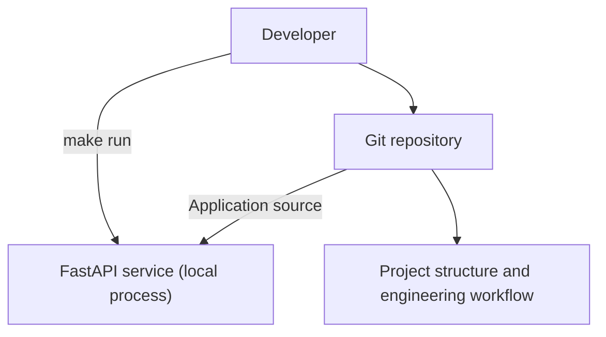
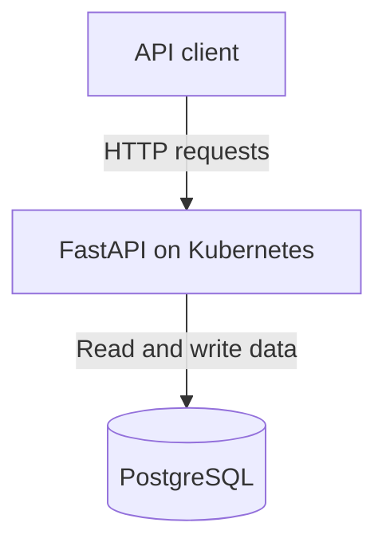
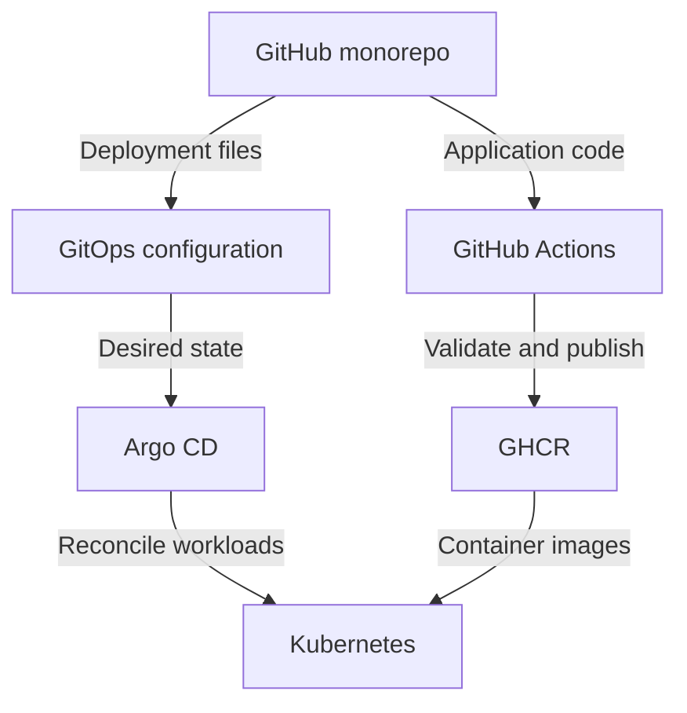
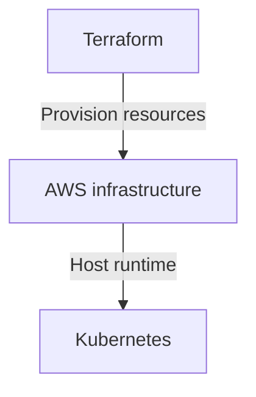
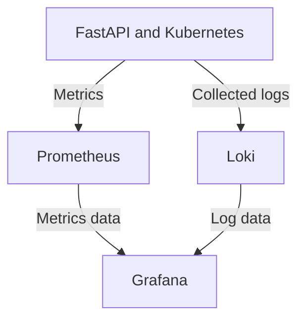

# Architecture Overview

## 1. Purpose

This document records the **Current Architecture** and **Target Architecture**
of One Serious Project. The target architecture represents direction rather
than current implementation. The project is built incrementally, and claims
about implemented capabilities must be supported by repository evidence.

## 2. Current Architecture

The repository is in **v0.1.0 — Application MVP**. Epic 0 — Bootstrap is
complete, and the first runtime component exists: a FastAPI service that a
developer runs locally with Uvicorn. There is no datastore, container, pipeline,
or cloud infrastructure yet.



What exists today:

- A FastAPI application in `app/` with a `GET /` endpoint that returns the
  service name, running state, and environment name.
- Application configuration read from `APP_ENV`, `APP_HOST`, `APP_PORT`, and
  `LOG_LEVEL`, with pinned runtime dependencies in `app/requirements.txt`.
- A `Makefile` providing `make help`, `make install`, and `make run`.
- A monorepo directory structure with reserved component directories.
- Shared repository configuration in `.editorconfig` and `.gitignore`, and a
  license.
- Project documentation, a roadmap, and engineering guidance in `README.md`,
  `AGENTS.md`, and `CLAUDE.md`.
- Issue and pull request templates, plus a documented development workflow.
- This architecture overview and accepted decisions for the
  [monorepo](../adr/001-monorepo.md) and
  [Terraform and cloud targets](../adr/002-terraform-and-cloud-targets.md).

The service holds no state, exposes no domain resource, and has no database,
health, metrics, or automated test coverage; those are the remaining Application
MVP tickets. Logging currently uses the standard library default format, not the
structured format planned for log aggregation. The infrastructure, deployment,
observability, automation, and test directories contain placeholders.
`.github/workflows/` also contains only a placeholder; CI jobs have not been
implemented. The documented [development workflow](../development/workflow.md)
defers required CI checks and branch protection until CI is available.

## 3. Target Architecture — Planned

The delivery, runtime, observability, and infrastructure capabilities below
are planned. The developer and GitHub repository provide their existing
starting point. Components will be introduced incrementally through the
[project milestones](../roadmap.md).

The views below each show one part of the target architecture. Read each
diagram from top to bottom; repeated components refer to the same system.

### 3.1 Application Runtime — Planned

The FastAPI application handles API requests and stores data in PostgreSQL.
Kubernetes will run the application, first locally with kind and later on AWS.
PostgreSQL hosting remains a decision for a later ticket.



### 3.2 Build and Deployment — Planned

A developer pushes changes to the monorepo. One path builds and publishes
container images; the other supplies the desired deployment configuration.
Both paths meet at the Kubernetes cluster.



GitHub Actions validates code, builds images, and publishes them to GitHub
Container Registry (GHCR). GitOps configuration lives in the same monorepo and
records the desired workloads and image references, using raw Kubernetes
resources first and Helm charts later. Argo CD reconciles that configuration;
Kubernetes pulls the referenced images from GHCR. The mechanism for updating
image references in Git remains a decision for a later ticket.

### 3.3 Cloud Infrastructure — Planned

Terraform is the selected Infrastructure as Code tool. AWS is the first cloud
target, introduced after the local platform is ready.



Terraform definitions will live in `infrastructure/`. Terraform provisions
the cloud foundation; Argo CD manages the application deployments shown in
the delivery view. Specific AWS services and the Kubernetes hosting model
remain decisions for later tickets.

The long-term goal is to make the project deployable to a choice of AWS, Azure,
GCP, or DigitalOcean. The rollout is incremental:

| Stage | Deployment target | Scope |
| --- | --- | --- |
| Local platform | kind | Establish Kubernetes locally before cloud infrastructure. |
| First cloud implementation | AWS | Focus of v0.8.0 — Cloud Infrastructure, using Terraform. |
| Future cloud targets | Azure, GCP, DigitalOcean | Add deployment support through later tickets; no release assigned yet. |

All deployment targets remain planned. Each additional cloud will need its
own infrastructure configuration and validation. See
[ADR-002](../adr/002-terraform-and-cloud-targets.md) for the tool and cloud
rollout decision.

### 3.4 Observability — Planned

Application and platform telemetry feed two data sources. Grafana uses both
to help inspect system behavior.



The arrows show telemetry flow. Metrics collection details and log-collection
tooling will be defined in later tickets.

## 4. Architecture Layers

All layers below describe planned capabilities.

### Application

**Planned:** Python, FastAPI, and PostgreSQL.

**Purpose:** Provide a realistic workload for demonstrating platform
engineering and application delivery.

### Build and Delivery

**Planned:** GitHub Actions and GitHub Container Registry.

**Purpose:** Automated validation, builds, and artifact publishing.

### Runtime Platform

**Planned:** Kubernetes and Helm.

**Purpose:** Application orchestration and packaging. Helm will follow working
raw Kubernetes resources.

### GitOps

**Planned:** Argo CD.

**Purpose:** Declarative deployment and desired-state reconciliation.

### Infrastructure

**Planned:** Terraform, with AWS as the first cloud target. Azure, GCP, and
DigitalOcean are future deployment targets.

**Purpose:** Reproducible cloud infrastructure introduced after the local
platform is ready. Additional cloud targets will be implemented incrementally
under the [Terraform and cloud rollout decision](../adr/002-terraform-and-cloud-targets.md).

### Observability

**Planned:** Prometheus, Grafana, and Loki.

**Purpose:** Metrics, dashboards, alerts, and logs for understanding system
behavior and diagnosing problems.

### Reliability and Security

**Planned areas:**

- Health checks.
- Resource limits.
- Autoscaling.
- Backup and restore.
- Security scanning.
- Secrets management.
- Failure testing.
- Incident response.

**Purpose:** Make operational health, recovery, and security practices
observable and verifiable as runtime capabilities are introduced.

## 5. Architecture Evolution

The intended evolution follows the [release roadmap](../roadmap.md):

```text
Bootstrap
    ↓
Application MVP
    ↓
Containers
    ↓
CI
    ↓
Kubernetes
    ↓
Helm
    ↓
GitOps
    ↓
Observability
    ↓
Cloud Infrastructure (Terraform, AWS first)
    ↓
Security and Reliability
    ↓
Production Simulation
```

Azure, GCP, and DigitalOcean deployment support is a longer-term goal beyond
the initial AWS cloud milestone; releases for those targets are not assigned.

Update this architecture documentation as each stage becomes real. Move
capabilities into the current architecture only after their implementation
and relevant validation exist. Record significant decisions in ADRs and keep
the target direction aligned with the evolving roadmap.

## 6. Current Milestone

The current milestone is **v0.1.0 — Application MVP**, consistent with the
[README](../../README.md) and [roadmap](../roadmap.md). The next planned release
milestone is **v0.2.0 — Containers**.
